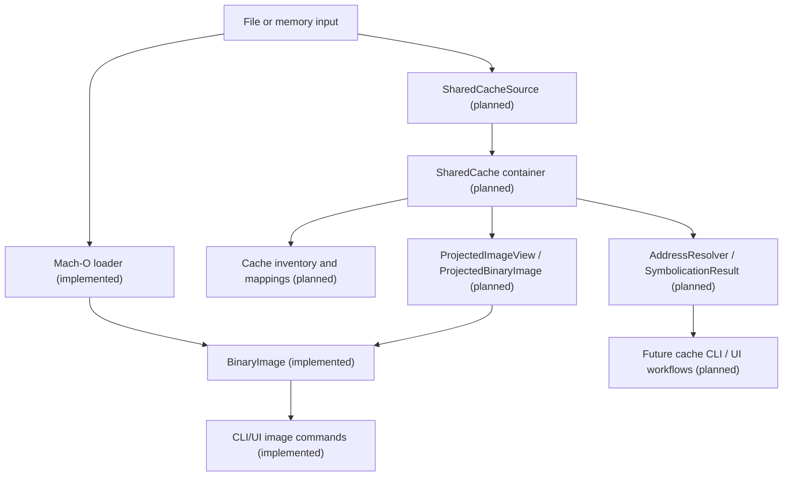
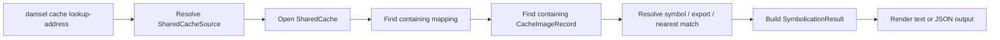

# Apple Runtime Analysis Architecture

Status: Planned architecture. This document describes target structure and interfaces that are **not yet implemented** unless explicitly labeled as current.

## Summary

`damsel` is already a Mach-O-first Apple analysis tool. The next architectural step is to make it an Apple runtime analysis tool that can:

- inspect standalone Mach-O images
- understand dyld metadata in those images
- inspect dyld shared caches as first-class containers
- resolve cache addresses and symbols for debugging and symbolication workflows
- project selected cache images into the existing per-image analysis pipeline

The current implemented present remains:

- `BinaryImage` as the per-image analysis model
- `damsel-macho` as the Mach-O loader and dyld extractor
- `damsel-cli` as the image-oriented CLI surface

The planned future adds a sibling runtime container model rather than replacing the existing image model.

## Current Implemented Present

Today the main architecture is:

- input bytes or file path
- Mach-O loading in `damsel-macho`
- typed per-image model in `damsel-core`
- image-oriented CLI/UI rendering

Current implemented dyld coverage includes:

- imported dylibs and rpaths
- export trie decoding
- function starts
- bind and chained-fixup metadata
- stubs and stub helpers
- dyld-aware disassembly annotations

Current implemented exclusions:

- no shared-cache loader
- no cache-wide image inventory
- no cache-wide address lookup
- no cache symbolication surface
- no cache-backed projection into image commands

## Target Layered Architecture

### 1. Source Ingestion

Implemented present:

- standalone file path or in-memory bytes

Planned addition:

- `SharedCacheSource`

Responsibilities:

- accept a path to any cache member file
- canonicalize to the cache root and cache set
- discover sibling subcaches and required sidecars
- keep the source read-only

Default v1 assumption:

- the loader accepts a path to a shared-cache member and auto-discovers the full set in the same location

### 2. Mach-O Loader

Implemented present:

- `damsel-macho` loads one Mach-O into `BinaryImage`
- slice selection and current dyld/ObjC extraction stay here

Planned role:

- remain the implementation owner for projected per-image loading in the first shared-cache waves
- do not create a new workspace crate in v1 unless reuse becomes impossible

### 3. dyld Metadata Extraction

Implemented present:

- `DyldMetadata` is attached to `BinaryImage`
- exports, bindings, stubs, helpers, rebases, binds, and chained-fixup presence are already typed

Planned role:

- preserve the current per-image dyld model
- reuse it for projected cache images where a projection path exists

### 4. Shared-Cache Container Model

Planned addition:

- `SharedCacheHeader`
- `SharedCache`
- `CacheImageRecord`
- cache-level mapping/index types

Responsibilities:

- parse cache/container metadata
- expose image inventory
- expose mapping information
- expose cache UUID/build identity
- expose local-symbol availability
- own cache-wide address space interpretation

### 5. Projected Image Views

Planned addition:

- `ProjectedImageView` or `ProjectedBinaryImage`

Responsibilities:

- lazily materialize a cache-contained image into a per-image analysis view
- preserve the `BinaryImage`-style semantics that existing Mach-O commands already expect
- avoid copying the entire shared cache into per-image buffers

Design rule:

- projection is an adapter from `SharedCache` to image-oriented analysis, not a second independent image-analysis stack

### 6. Address and Symbol Resolution

Planned addition:

- `AddressResolver`
- `SymbolicationResult`

Responsibilities:

- map cache VM addresses to cache mappings
- identify containing cache images
- resolve exact or nearest symbol/export matches
- support debugging and crash-symbolication workflows
- provide stable typed results for CLI and later UI/debugger integration

### 7. CLI and UI Presentation

Implemented present:

- image-oriented commands such as `info`, `sections`, `symbols`, `imports`, `dyld`, `objc`, and `disasm`

Planned addition:

- top-level `cache` command family

Design rule:

- current Mach-O commands stay image-oriented
- future shared-cache workflows get their own cache-oriented command family
- only later waves should route selected cache images into existing image commands

## Architecture Diagram

## Query Flow Diagram

## Data and Ownership Boundaries

- `BinaryImage` stays the canonical per-image analysis value.
- `SharedCache` owns cache-set identity, mappings, image inventory, and cache-wide address semantics.
- projected images should borrow or reference cache-backed bytes where practical rather than eagerly copying image payloads
- cache-wide indexes should be deterministic and reusable across many queries

## Invariants

- cache-aware functionality must not change current standalone Mach-O behavior
- cache container APIs must stay read-only in the first wave
- projected image views must preserve existing image-oriented semantics where they claim compatibility
- cache VM addresses and projected image addresses must be labeled clearly and never conflated in output

## Internal Operator Appendix

### Primary Use Cases

- symbolicate cache-backed addresses during debugging
- identify which system framework owns an address or symbol
- inspect exports of system frameworks without extracting every image by hand
- spelunk framework boundaries, stubs, and runtime linkages across cache-contained images

### Cache Acquisition and Environment Assumptions

- the operator provides a readable dyld shared cache file or cache file set
- cache analysis is expected to be read-only
- the operator is responsible for ensuring the cache artifact matches the target OS build or debugging environment when exact symbolication matters
- split-cache layouts and local-symbol sidecars should be preserved together when copied for offline analysis

### When SIP-Adjacent Constraints Matter

- some low-level debugging and research workflows depend on local platform state that may be restricted on stock systems
- shared-cache research may be paired with protected-process inspection, platform debugging, or other environment-sensitive workflows
- `damsel` should not automate or prescribe system-configuration changes
- internal docs and future tooling may describe environment constraints, expected artifacts, and correlation requirements, but operational system changes remain outside the tool's scope

## Out of Scope For This Architecture Pass

- non-Apple binary formats
- debugger transport/injection design
- cache mutation or rebuilding
- code-signing or system-modification tooling

## Cross References

- [ADR-0001: Apple Runtime Focus](../adr/ADR-0001-apple-runtime-focus.md)
- [ADR-0002: Shared-Cache Container Model](../adr/ADR-0002-shared-cache-container-model.md)
- [dyld Shared Cache v1 Spec](../specs/dyld-shared-cache-v1.md)
- [Apple Runtime Analysis Roadmap](../roadmaps/apple-runtime-analysis-roadmap.md)
