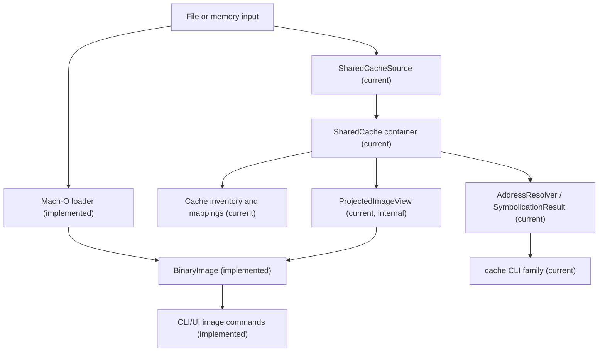
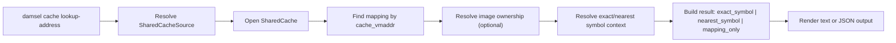

# Apple Runtime Analysis Architecture

Status: Current architecture with Wave 1, Wave 2, and Wave 3 shared-cache work implemented. Future items remain planned only where explicitly labeled as such.

## Summary

`damsel` is already a Mach-O-first Apple analysis tool. The next architectural step is to add a read-only dyld shared-cache container model that can:

- inspect standalone Mach-O images (current)
- understand dyld metadata in those images (current)
- inspect dyld shared caches as first-class containers (current)
- resolve cache addresses and symbols for debugging/symbolication workflows (current, Wave 1)
- project selected cache images into existing per-image analysis flows (current, Wave 2)
- query cache-native dependencies, dependents, providers, importers, and reexports for offline debugging/spelunking (current, Wave 3)

The current runtime container model sits beside the existing image model and does not replace it.

## Current Implemented Present

Today the main architecture is:

- input bytes or file path
- Mach-O loading in `damsel-macho`
- typed per-image model in `damsel-core`
- image-oriented CLI/UI rendering

Current implemented dyld coverage includes:

- imported dylibs and rpaths
- export trie decoding
- function starts
- bind and chained-fixup metadata
- stubs and stub helpers
- dyld-aware disassembly annotations

Current implemented exclusions:

- no top-level bridge from standalone image commands into cache-backed images
- no live debugger integration
- no cache mutation or rebuilding

## Target Layered Architecture

### 1. Source Ingestion

Implemented present:

- standalone file path or in-memory bytes

Implemented present:

- `SharedCacheSource`

Responsibilities:

- accept a path to any cache member file
- canonicalize to a deterministic cache root/member set
- discover required sibling subcaches in deterministic order
- treat `.symbols` sidecar as optional metadata input
- keep the source read-only

Deterministic discovery rules:

- input path may be root member, numbered subcache member, or `.symbols` sidecar
- root candidate derivation:
  - strip `.symbols` suffix when present
  - else strip trailing `.<decimal>` suffix when present
  - else use the input path directly
- parse root and use `subcache_suffixes()` as authoritative required member order
- ordered member set: root, required numbered members, optional UUID-compatible `.symbols` sidecar last

### 2. Mach-O Loader

Implemented present:

- `damsel-macho` loads one Mach-O into `BinaryImage`
- slice selection and current dyld/ObjC extraction stay here

Current role:

- remain implementation owner for projected per-image loading in v1
- keep cache-aware loading in `damsel-macho` and avoid a new crate in v1

### 3. dyld Metadata Extraction

Implemented present:

- `DyldMetadata` is attached to `BinaryImage`
- exports, bindings, stubs, helpers, rebases, binds, and chained-fixup presence are already typed

Current role:

- preserve the current per-image dyld model
- reuse it for projected cache images where projection is available

### 4. Shared-Cache Container Model

Implemented present:

- `SharedCacheHeader`
- `SharedCache`
- `CacheImageRecord`
- cache-level mapping/index types

Responsibilities:

- parse cache/container metadata
- expose image inventory
- expose mapping information
- expose cache UUID/build identity
- expose local-symbol availability
- own cache-wide address-space interpretation

### 5. Projected Image Views

Implemented present:

- `ProjectedImageView` or `ProjectedBinaryImage` (internal in v1)

Responsibilities:

- lazily materialize a cache-contained image into a per-image analysis view
- preserve `BinaryImage`-style semantics expected by existing analysis flows
- avoid eager copy of full cache payloads

Design rule:

- projection is an adapter from `SharedCache` to image-oriented analysis, not a second independent image-analysis stack

### 6. Address and Symbol Resolution

Implemented present:

- `AddressResolver`
- `SymbolicationResult`

Responsibilities:

- map `cache_vmaddr` to containing cache mapping
- identify containing image when possible
- resolve exact symbol/export match when available
- resolve nearest lower symbol/export plus offset when exact is absent
- return `mapping_only` success when address is mapped but image ownership cannot be resolved

Locked address vocabulary:

- `cache_vmaddr`
- `image_base_vmaddr`
- `image_offset`
- `member_file_offset`

### 7. CLI and UI Presentation

Implemented present:

- image-oriented commands such as `info`, `sections`, `symbols`, `imports`, `dyld`, `objc`, and `disasm`

Implemented present:

- top-level `cache` command family

Design rules:

- current Mach-O commands stay image-oriented in v1
- shared-cache workflows land in `cache` commands, not `doctor` or `dyld` overloads
- filter/match semantics stay deterministic:
  - `--name` and `--image` substring filters are ASCII case-insensitive
  - symbol lookup is exact and case-sensitive
  - command pipelines are filter -> sort -> limit

## Component Diagram

## Query Flow Diagram

## Data and Ownership Boundaries

- `BinaryImage` stays the canonical per-image analysis value.
- `SharedCache` owns cache-set identity, mappings, image inventory, and cache-wide address semantics.
- projected images should borrow or reference cache-backed bytes where practical.
- cache-wide indexes should be deterministic and reusable across repeated queries.

## Invariants

- cache-aware functionality must not change current standalone Mach-O behavior
- cache container APIs stay read-only in v1
- projected image views preserve existing image-oriented semantics where compatibility is claimed
- cache and projected image addresses are labeled explicitly and never conflated
- image identity remains stable as `<cache_uuid>:<image_index>`
- basename ambiguity is a typed outcome (`cache_image_ambiguous`), not collapsed into not-found

## Internal Operator Appendix

### Primary Use Cases

- symbolicate cache-backed addresses during debugging
- identify which system framework owns an address or symbol
- inspect exports of system frameworks without manual extraction
- spelunk framework boundaries, stubs, and runtime linkages across cache-contained images

### Cache Acquisition and Environment Assumptions

- the operator provides a readable dyld shared cache file or cache set
- cache analysis is read-only
- cache artifacts should match the target OS build when exact symbolication matters
- split-cache members and sidecars should remain colocated for offline analysis fidelity

### When SIP-Adjacent Constraints Matter

- some low-level debugging and research workflows are environment-sensitive on stock systems
- shared-cache research may be paired with protected-process inspection and platform debugging
- `damsel` does not automate or prescribe system-configuration changes
- tooling/docs may describe required artifacts and environment constraints, but operational system changes remain out of scope

## Out of Scope For This Architecture Pass

- non-Apple binary formats
- debugger transport/injection design
- cache mutation or rebuilding
- code-signing or system-modification tooling

## Cross References

- [ADR-0001: Apple Runtime Focus](../adr/ADR-0001-apple-runtime-focus.md)
- [ADR-0002: Shared-Cache Container Model](../adr/ADR-0002-shared-cache-container-model.md)
- [dyld Shared Cache v1 Spec](../specs/dyld-shared-cache-v1.md)
- [Apple Runtime Analysis Roadmap](../roadmaps/apple-runtime-analysis-roadmap.md)
